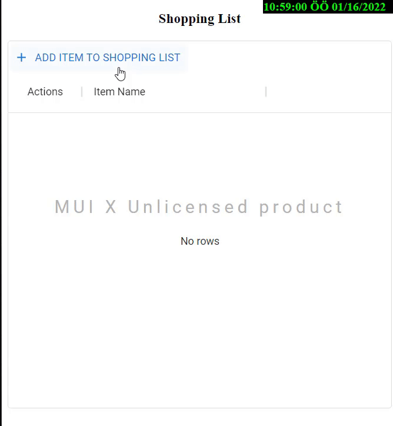

# grocery-shopping-list
It concerns the solution of the desired task in applying for a job.

A shopping list application has been created using MERN (MongoDB, Express, React, Node) Stack.

This repository consists of two projects: Express JS and React JS.

The products in the list can be added, removed and edited.

The data is stored in MongoDB on the remote server.

# Case Description

"Create a grocery shopping list. You can add items in the frontend. This data is stored in the backend. The list shows the items. You can create new items, you can delete items and you can modify items. So, if you want to change "tomaeteos" (misspelled) to "tomatoes", you can. All updated are stored in backend."

# Output



# How to use
- Do the 
```sh
npm install 
```
sequentially in both projects.
- In the api project, use your connection information into the variable named YOUR_CONNECTION_STRING in the env file. (Do not remove double-quote and when the project is not running)
- You can write 
```sh
npm start 
```
anymore sequentially in both projects.
- You will see your DB connection state on Express Console.
- That's it!

